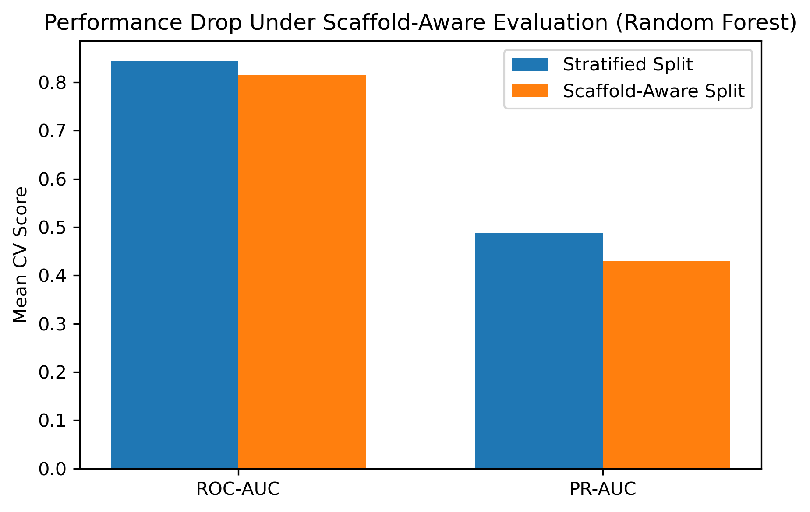
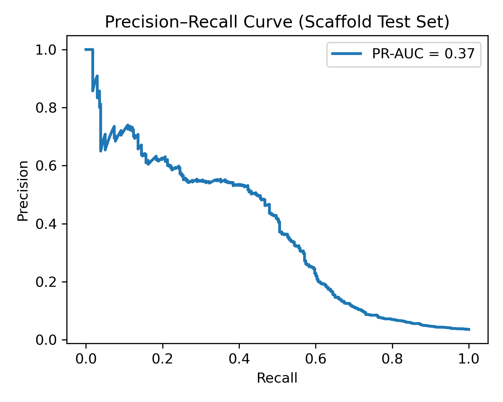
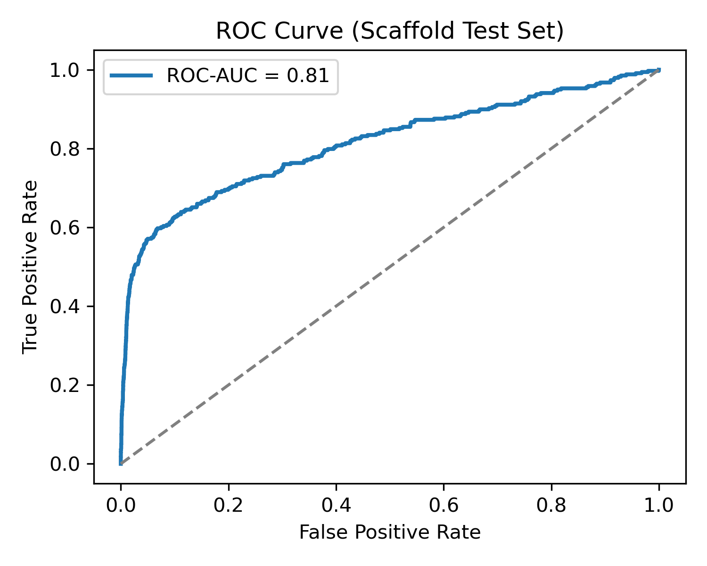
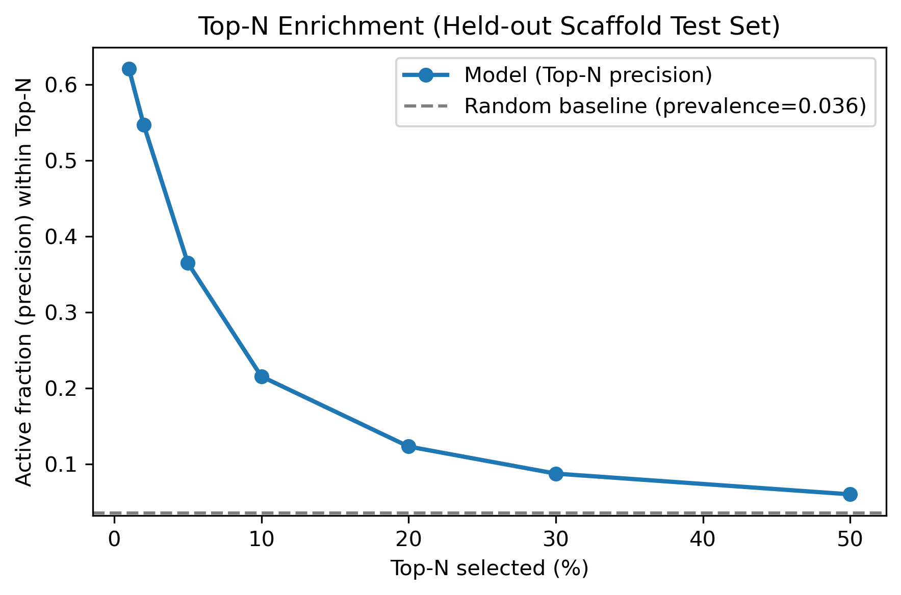

# QSAR-Based Activity Prioritization for HIV Inhibitor Discovery  
**A scaffold-aware, imbalance-aware virtual screening workflow**

---

## Project Overview

This project implements a chemically realistic QSAR workflow for prioritizing HIV inhibitor candidates under severe class imbalance.  
Rather than treating activity prediction as a hard binary classification task, the primary objective is **compound ranking for early-stage virtual screening**, where experimental throughput is limited and early enrichment is critical.

A central design principle of this work is **scaffold-aware evaluation**, ensuring that reported performance reflects generalization to **unseen chemical scaffolds**, rather than memorization of close analogs.

---

## Dataset

- **Source:** MoleculeNet – HIV benchmark  
- **Size:** ~41,000 small molecules  

### Activity Labels
- **Active:** Confirmed Active (CA), Confirmed Moderately Active (CM)  
- **Inactive:** Confirmed Inactive (CI)  

- **Class imbalance:** ~4% actives  

Due to this strong imbalance, **accuracy is not a meaningful performance metric**. Model evaluation therefore focuses on metrics appropriate for ranking and early retrieval.

---

## Molecular Representation

Each compound is represented using a hybrid feature set combining interpretability and expressive power.

### Physicochemical Descriptors (RDKit)
- Molecular Weight (MolWt)  
- LogP (MolLogP)  
- Topological Polar Surface Area (TPSA)  
- Hydrogen bond donors and acceptors  
- Number of rotatable bonds  

These descriptors provide chemically interpretable context related to permeability, solubility, and binding propensity.

### Morgan Fingerprints
- Radius = 2 (ECFP4)  
- 2048-bit hashed fingerprints  

Fingerprints encode local substructural patterns critical for modeling non-linear structure–activity relationships.

---

## Data Splitting Strategy (Critical Design Choice)

Two evaluation strategies are compared:

- **Stratified split:** Preserves class balance but permits scaffold leakage  
- **Scaffold-aware split (Murcko scaffolds):** Enforces zero scaffold overlap between training and test sets  

The scaffold-aware split provides a **chemically realistic estimate of generalization performance** and is therefore used for final model evaluation.

The observed performance degradation from stratified to scaffold splits is expected and reflects the **removal of chemical information leakage**.

  
*Stratified cross-validation yields higher ROC-AUC and PR-AUC due to scaffold overlap, while scaffold-aware evaluation enforces structural separation and provides a more realistic estimate of generalization to unseen chemical scaffolds.*

---

## Models Evaluated

All models were evaluated using cross-validation on the training set.

- **Logistic Regression** — linear baseline  
- **Random Forest** — primary model, robust to noisy biological labels  
- **XGBoost** — additional non-linear benchmark  

**Random Forest** was selected as the final model due to its stable performance, strong PR-AUC, and consistent generalization under scaffold-aware evaluation.

---

## Evaluation Metrics

Given the screening-oriented objective, the following metrics are emphasized:

- **ROC-AUC:** Global ranking ability  
- **PR-AUC:** Performance under severe class imbalance  
- **Top-N enrichment:** Early recovery of active compounds  
- **Recall (active class):** Reported but not optimized at a fixed threshold  

---

## Final Results (Held-Out Scaffold Test Set)

- **ROC-AUC:** 0.81  
- **PR-AUC:** 0.37  

At the default decision threshold (0.5), recall is intentionally conservative.  
This reflects a **prioritization-focused decision strategy**, rather than aggressive binary classification.

  
*PR-AUC is emphasized due to severe class imbalance (~4% actives), reflecting realistic screening performance.*

  
*ROC-AUC summarizes global ranking ability, reported alongside PR-AUC for completeness.*

---

## Early Enrichment Performance

Top-N enrichment analysis demonstrates strong prioritization of active compounds:

- **Top 1%:** ~17× enrichment over random  
- **Top 5%:** ~10× enrichment  
- **Top 10%:** ~6× enrichment  

These results indicate that the model effectively concentrates true actives among the highest-ranked candidates, which is essential for practical virtual screening campaigns.

  

---

## Key Takeaways

- Scaffold-aware evaluation is essential for realistic QSAR modeling  
- PR-AUC and enrichment metrics are more informative than accuracy for imbalanced datasets  
- The final model generalizes well to unseen chemical scaffolds  
- Conservative recall reflects a deliberate screening strategy, not model failure  

---

## Tools & Libraries

- Python  
- RDKit  
- scikit-learn  
- NumPy, pandas  
- matplotlib, seaborn  

---

## Author

**Nezihe Mohiuddin**  
📧 nezihemohiuddin@gmail.com

---

## Future Extensions

- Applicability domain estimation  
- Descriptor and fingerprint importance analysis (e.g., SHAP)  
- Chemical space clustering using Tanimoto similarity  
- Graph Neural Network (GNN) models for structure-aware learning  

